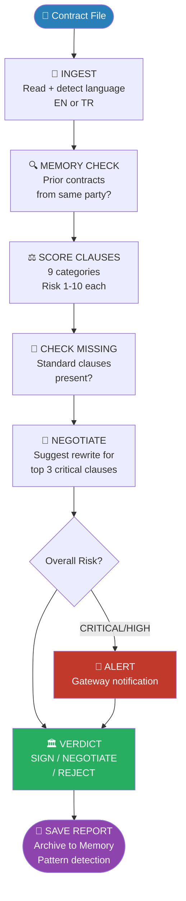
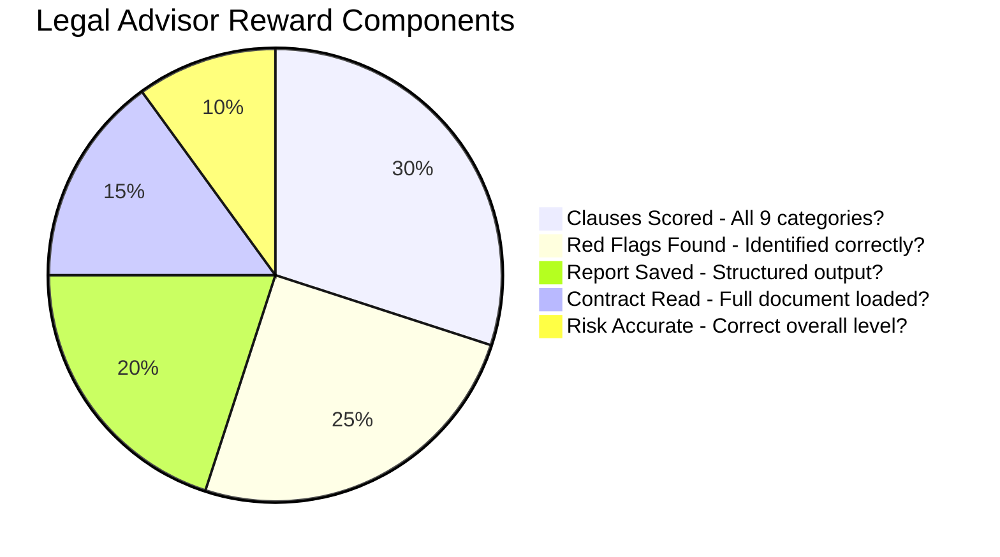
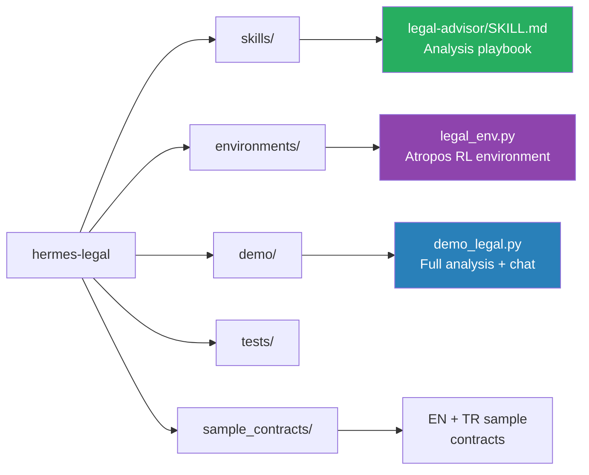

# Hermes Legal Advisor ⚖️

**Autonomous contract analysis agent that reads what you might miss.**

> Built for the NousResearch "Show us what Hermes Agent can do" hackathon.

Contracts are dense, tedious, and full of clauses that sound reasonable until a lawyer
tells you they aren't. Hermes Legal Advisor reads every clause, scores every risk,
suggests negotiation language, gives you a final verdict, and remembers every
contract it has ever analyzed - in English and Turkish.

## What It Does

Feed it a contract. It reads the full document, scores each clause for risk,
flags red flags, suggests how to rewrite problematic clauses, checks for missing
standard clauses, compares against previously analyzed contracts, and delivers
a final **SIGN / NEGOTIATE / REJECT** verdict.

**The more contracts you analyze, the smarter it gets at spotting patterns.**

## Architecture



## Hermes Features Used

| Feature | How It's Used |
|---------|--------------|
| **Memory** | Stores every analyzed contract - detects if counter-party terms are getting worse |
| **Skills** | Legal playbook defines scoring rubric, red flags, and verdict logic |
| **Subagents** | Parallel clause scoring - each category analyzed independently |
| **Gateway** | Sends CRITICAL/HIGH alerts (extensible to email/Slack/Telegram) |
| **Atropos RL** | Reward function trains Hermes to find more red flags with higher accuracy |

## Key Features

| Feature | Description |
|---------|-------------|
| 🌐 **Bilingual** | English and Turkish contract analysis |
| ⚖️ **9-Clause Scoring** | Every clause scored 1-10 with reasoning |
| 💬 **Negotiation Text** | Suggests how to rewrite critical clauses |
| 🔎 **Missing Clause Detection** | Flags standard clauses that are absent |
| 🏛️ **Final Verdict** | SIGN / NEGOTIATE / REJECT with reasoning |
| 🧠 **Memory** | Compares against all prior contracts from same party |
| 💬 **Chat Mode** | Ask questions about clauses and past analyses |

## Risk Scoring

| Score | Level | Meaning |
|-------|-------|---------|
| 9-10 | 🔴 CRITICAL | Red flag - potentially unacceptable |
| 7-8 | 🟠 HIGH | Significantly unfavorable - negotiate |
| 5-6 | 🟡 MEDIUM | Worth noting - review carefully |
| 1-4 | 🟢 LOW | Standard and acceptable |

## Automatic Red Flags

- Termination notice < 7 days (one party only)
- Uncapped liability on one party only
- IP assignment covering personal-time work
- Non-compete > 2 years or worldwide scope
- Auto-renewal with < 30 days cancellation window
- Arbitration costs borne entirely by one party

## Quick Start

```bash
pip install openai rich
set OPENROUTER_API_KEY=sk-or-...

python demo/demo_legal.py --contract sample_contracts/freelance_contract.txt
python demo/demo_legal.py --contract sample_contracts/nda_contract.txt
python demo/demo_legal.py --contract sample_contracts/employment_contract.txt
python demo/demo_legal.py --turkish
python demo/demo_legal.py --chat
```

## Reward Function



## Project Structure



## Disclaimer

Hermes Legal Advisor provides contract analysis, not legal advice.
Always consult a qualified attorney before signing any contract.
